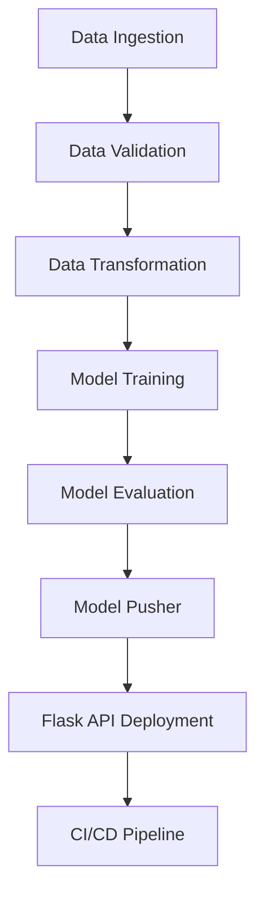

Here is a **professional and visually appealing `README.md`** tailored specifically to your MLOps project. This file is crafted to **impress recruiters or project reviewers**, highlighting your deep understanding of real-world MLOps lifecycle using tools like MongoDB, AWS, Docker, GitHub Actions, and more.

---

````markdown
# 🚗 Vehicle Insurance MLOps Project

Welcome to the **Vehicle Insurance MLOps Pipeline** – a real-world, end-to-end machine learning operations workflow designed to demonstrate robust automation, production deployment, and data handling.

> 💡 **Goal**: To showcase your ability to build and deploy a full-stack ML system with DevOps practices – ideal for impressing recruiters and showcasing project experience.

---

## 📌 Highlights

- 🧱 Project Scaffold with Python Packaging
- 🗃️ MongoDB Atlas for Cloud Data Storage
- 🔎 EDA, Data Validation, and Feature Engineering
- 🤖 Model Training, Evaluation & Registry with AWS S3
- 🚀 REST API Deployment with Flask
- ⚙️ CI/CD Automation with GitHub Actions, Docker, AWS EC2 + ECR

---

## 🏗️ Project Setup

### ✅ Project Initialization
```bash
python template.py
````

### 📦 Packaging

Create `setup.py` and `pyproject.toml` to manage imports across modules.

### 🧪 Environment & Dependencies

```bash
conda create -n vehicle python=3.10 -y
conda activate vehicle
pip install -r requirements.txt
pip list
```

---

## 📊 MongoDB Atlas Integration

1. Create an account on [MongoDB Atlas](https://www.mongodb.com/cloud/atlas).
2. Setup a free M0 cluster and a database user.
3. Add IP access (`0.0.0.0/0`) and get the Python connection string.
4. Save and update the string in your environment as `MONGODB_URL`.

### 🧾 Upload Data

* Add your dataset to the `notebook/` folder.
* Use `mongoDB_demo.ipynb` to upload data.
* Verify in **MongoDB > Collections** view.

---

## 📋 Logging, Exception Handling & EDA

* ✅ Implemented robust `logger.py` and `exception.py` (tested in `demo.py`)
* 🧠 Initial EDA and Feature Engineering done via Jupyter notebooks.

---

## 🧩 Data Ingestion Pipeline

### 🔧 Components

* MongoDB connection: `configuration.mongo_db_connections.py`
* Data access logic: `data_access/proj1_data.py`
* Entity classes: `entity/config_entity.py`, `artifact_entity.py`
* Core pipeline: `components/data_ingestion.py`

```bash
# Setup MongoDB URL (Mac/Linux)
export MONGODB_URL="your_connection_string"
# For PowerShell
$env:MONGODB_URL = "your_connection_string"
```

📄 Also add `artifact/` to `.gitignore`

---

## ✅ Data Validation, Transformation & Model Training

### 🔎 Data Validation

* Define schema in `config/schema.yaml`
* Implement logic in `utils/main_utils.py`

### 🔄 Data Transformation

* Feature pipelines in `components/data_transformation.py`
* Add logic to `entity/estimator.py`

### 🧠 Model Training

* Model training components in `components/model_trainer.py`

---

## ☁️ AWS Setup & Model Management

### 🔐 IAM & Access Key Setup

* Create a user in IAM with `AdministratorAccess`
* Set environment variables:

```bash
# Bash
export AWS_ACCESS_KEY_ID="your_key"
export AWS_SECRET_ACCESS_KEY="your_secret"
```

Update `constants/__init__.py`:

```python
MODEL_BUCKET_NAME = "my-model-mlproj"
MODEL_PUSHER_S3_KEY = "model-registry"
MODEL_EVALUATION_CHANGED_THRESHOLD_SCORE = 0.02
```

### 🗃️ AWS S3 Bucket

* Create S3 Bucket: `my-model-mlproj` (Region: `us-east-1`)
* Add code to:

  * `src/aws_storage/`
  * `entity/s3_estimator.py`

---

## 🧪 Model Evaluation & API Deployment

* Build `model_evaluation.py` and `model_pusher.py`
* Setup REST API using `Flask` in `app.py`
* Add `static/` and `templates/` for UI

---

## 🔁 CI/CD Automation (Docker + GitHub Actions)

### 🐳 Docker Setup

* Create `Dockerfile` and `.dockerignore`

### 🤖 GitHub Actions

* Add `.github/workflows/aws.yaml`
* Setup GitHub secrets:

  * `AWS_ACCESS_KEY_ID`
  * `AWS_SECRET_ACCESS_KEY`
  * `AWS_DEFAULT_REGION`
  * `ECR_REPO`

---

## 🖥️ AWS EC2 + ECR Deployment

### ☁️ EC2 Setup

* Launch EC2 (Ubuntu, T2.medium, 30GB, public IP)
* Install Docker:

```bash
curl -fsSL https://get.docker.com -o get-docker.sh
sudo sh get-docker.sh
sudo usermod -aG docker ubuntu
newgrp docker
```

### ⚙️ Self-hosted Runner

1. Go to **GitHub > Settings > Actions > Runners**
2. Follow Linux runner instructions on EC2 instance
3. Run `./run.sh` to connect

---

## 🧠 Trigger CI/CD & Serve API

* Push any change to trigger GitHub Actions.
* Open port `5080` on EC2:

  * EC2 > Security Groups > Edit inbound rules > Custom TCP > 5080 > 0.0.0.0/0
* Visit:

```
http://<your-ec2-public-ip>:5080
```

### 🧪 For On-Demand Training:

```
http://<your-ec2-public-ip>:5080/training
```

---

## 🧭 Project Flow Overview



---

## 🛠 Tech Stack

| Area               | Tools & Services                     |
| ------------------ | ------------------------------------ |
| Language           | Python 3.10                          |
| Package Management | pip, conda, pyproject.toml           |
| Data Storage       | MongoDB Atlas                        |
| Cloud              | AWS S3, EC2, IAM                     |
| Orchestration      | GitHub Actions                       |
| Containerization   | Docker, ECR                          |
| API Framework      | Flask                                |
| CI/CD              | Docker + GitHub Actions + EC2 Runner |

---

## ✅ Final Thoughts

This project is a complete demonstration of the **MLOps lifecycle**:

* Development → Deployment → Automation
* Fully cloud-integrated and production-ready

> 📢 Feel free to fork, explore, contribute, or deploy your own version!

---

**🔗 Author:** \[Your Name]
**📧 Contact:** \[[your.email@example.com](mailto:your.email@example.com)]
**🔗 GitHub:** \[github.com/your-profile]

---

```

---

### ✅ What’s Next?

Would you like me to:
- Generate this as a downloadable `README.md` file?
- Create a matching project banner for GitHub?
- Help you deploy this to your GitHub repository?

Let me know how you'd like to proceed!
```


